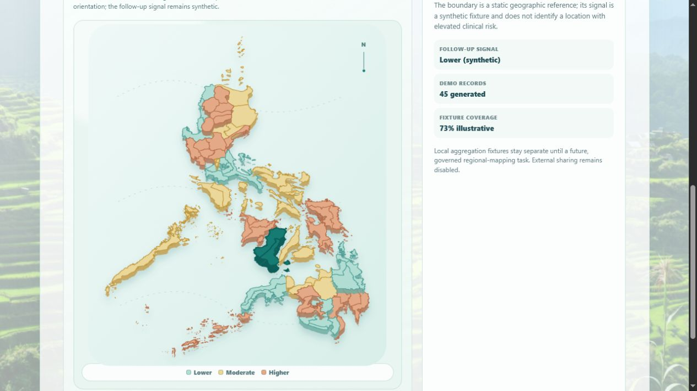

# TASK-006 review pack

## TASK-006 revision — Region-to-province drill-down

### User-visible effect

- Activating a region once selects it and changes its cursor to a magnifying glass; activating it again opens a focused province view.
- The focused view uses the province polygons already bundled for all 18 regions. NCR shows its four source districts, and NIR shows Negros Occidental, Negros Oriental, and Siquijor.
- A visible **Back to all regions** control and the Escape key return to the national view.
- App-screening mode shades provinces from eligible local profiles grouped by their saved municipality's province suffix. Public mode uses a neutral unavailable state because the LCP source has no province-level values.
- Combined mode retains the parent region's public signal as context and adds app-screening hatching without summing the two sources.

### Accessibility

- Region and province shapes remain operable with Enter and Space.
- Selected regions announce that a second activation opens their provinces.
- Focus moves to the drill-down back control, and view changes are announced through a polite live status.
- Reduced-motion preferences suppress the drill-down transition through the existing global motion rule.

### Limitations and follow-up

- The drill-down is province-level, not city-level. The bundled geometry contains ADM2 provinces and NCR districts but no ADM3 city or municipality polygons.
- Some highly urbanized cities do not map cleanly to a province suffix. City of Puerto Princesa is explicitly associated with Palawan; other unmatched profiles remain unshaded rather than being guessed.
- Future city-level work requires approved ADM3 geometry, license and provenance review, lazy per-region loading, and a PSGC-code crosswalk. No city boundaries or city-level public registry values are fabricated in this revision.

### Verification

- `npm.cmd test` passed: 10 test files, 57 passed and 4 skipped.
- Focused map and dashboard coverage passed for two-stage selection, MIMAROPA province counts, NCR districts, NIR province assembly, Escape/back behavior, and source-mode reset.
- `npm.cmd run build` passed.

## TASK-006 revision — Real regional boundary model

### Goal

Replace the illustrative numbered shapes with a recognizable, interactive Philippines map while preserving the dashboard's synthetic-data safety boundary.

### User-visible effect

- The map now renders real Philippine province outlines, grouped into the current 18 administrative regions.
- Each region is independently clickable and keyboard-selectable; its selection raises the regional geometry and updates the detail panel.
- The map now names the chosen administrative region, including the Negros Island Region (NIR), rather than showing arbitrary numbered blocks.
- Every displayed follow-up signal, count, and coverage value remains static synthetic demo data. Local de-identified fixtures remain unmapped and sharing remains disabled.

### Boundary provenance

- Geometry: 2023 Philippine province GeoJSON snapshot from `faeldon/philippines-json-maps`, retained locally under its MIT license in `src/assets/philippines-regions/SOURCE-LICENSE-MIT.txt`.
- Current regional roster: Philippine Statistics Authority (PSA) PSGC, which lists 18 regions. The NIR group is assembled from the source snapshot's Negros Occidental, Negros Oriental, and Siquijor province polygons.
- This is an offline visual-reference snapshot, not an authoritative survey, live GIS service, boundary adjudication tool, or clinical map.

### Showcase

1. Open **Heatmap status** from the front page.
2. Confirm the real regional/province outlines and the static-synthetic safeguard copy.
3. Select **Negros Island Region (NIR)** on the model.
4. Confirm that its detail panel updates while still identifying the signal as synthetic.

### Verification

- `npm.cmd run build` passed.
- Browser visual review passed: real boundary outlines render locally; NIR selection updates the named detail panel; no live-data claims were introduced.
- Focused map coverage passed: `src/components/PhilippinesRegionMap.test.tsx` verifies all 18 keyboard-selectable boundaries.
- Full suite scan: 9 passed / 5 failed in pre-existing screening-workflow assertions that still expect the older optional-field and no-local-file path. The new regional-dashboard assertion passed; no map-test failure was found.

### Limitations

- Boundary geometry is a bundled 2023 snapshot; it must be reviewed/replaced with an authorized current operational GIS source before any deployment or regional reporting.
- The 3D effect, colors, synthetic record counts, and follow-up labels are presentation fixtures only. They do not represent incidence, prevalence, care priority, clinical risk, or a prediction.
- No patient location has been mapped. External sharing remains disabled.

## Goal

Provide a useful, visually clear 18-region population-dashboard interaction without representing synthetic UI fixtures as live clinical or geographic data.

## User-visible feature

- The front-page **Heatmap status** control now opens a synthetic population dashboard.
- The dashboard has 18 numbered regional fixture cells, each selectable to reveal an illustrative follow-up-signal detail panel.
- The panel shows synthetic signal level, generated demo-record count, and illustrative fixture coverage.
- The dashboard reports the count of locally created TASK-005 population fixtures only as an unmapped total.
- Every screen states that the dashboard is synthetic, non-live, and not a clinical-risk estimate; sharing is disabled.

## Demo path

1. From the front page, choose **Heatmap status**.
2. Confirm the four synthetic-data safeguards and the 18 regional fixture cells.
3. Select any region, for example **Region 12**, and inspect the detail panel.
4. Confirm that the detail says it is illustrative and does not identify a location with elevated clinical risk.

## Changed files

- `src/App.tsx` — synthetic regional fixtures, selectable dashboard, local-population count display, and dashboard entry point.
- `src/styles.css` — responsive 18-cell regional grid, signal treatments, and selected-region panel.
- `src/App.test.tsx` — direct coverage for all 18 selectable cells, region selection, and no-live-data safeguards.
- `docs/stage/model-provenance.md` — fixture provenance and no-inference limitation.
- `docs/stage/reviews/assets/task-006-synthetic-dashboard.png` — visual evidence.

## Verification

- `npm.cmd test -- --run` passed: 13 tests.
- `npm.cmd run build` passed.
- Visual review passed: the 18-cell grid, selected region, and synthetic-data disclaimer are legible at the stage preview.

## TASK-006 revision - Interactive Philippines map surface

### User-visible effect

- The 18 regional cards are now represented by a native SVG, 3D-styled Philippines selection model.
- Each numbered fixture can be clicked or selected with Enter/Space. Selection raises the area visually and updates the region detail panel.
- A signal legend and explicit non-GIS disclaimer remain beside the map.

### Visual evidence

- [Interactive Philippines map](assets/task-006-interactive-philippines-map.png)

### Verification

- `npm.cmd test -- --run` passed: 14 tests, including direct map keyboard-selection coverage.
- `npm.cmd run build` passed.
- Visual review passed: selecting Region 12 on the map updates the selected-region panel while the synthetic-data safeguards remain visible.

### Revision limitations

- The Philippines shape and numbered areas are a stylized selection surface, not real administrative or GIS boundaries.
- Map height, signal color, and 3D depth are visual-only; they do not encode clinical severity, risk, or location data.

## Known limitations

- Regions are numbered synthetic fixtures, not named or attributed to real-world Philippine administrative areas.
- Color intensity does not indicate clinical risk, cancer incidence, follow-up need, or public-health status.
- No live aggregation, geographic mapping, public/environmental/hospital data, or external sharing exists.

## Promotion

- Status: **awaiting owner approval**
- Proposed promotion: `8e01ac8` — `feat(task-006): add synthetic regional dashboard`.
- Proposed TASK-006 revision: `af45d66` — `feat(task-006): add interactive map surface`.
- Proposed TASK-006 revision: `fcf01d4` — `feat(task-006): connect map to population fixtures`.
- Proposed TASK-006 boundary revision: `619ebbc` — `feat(task-006): use real regional boundaries`.
- Approval command: `Approve TASK-006 for main`.
