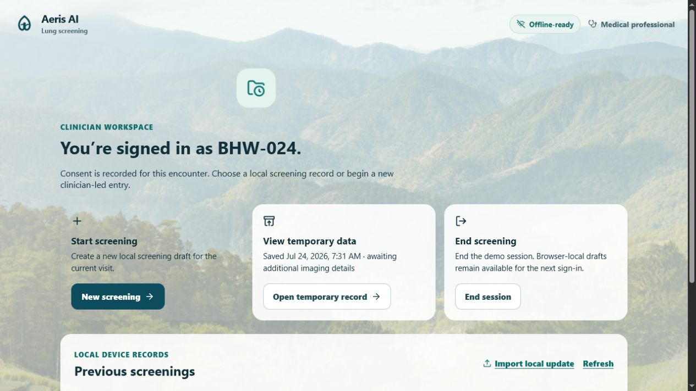

# TASK-007 review pack — Clinician encounter dashboard and local record selection

## Goal and user-visible feature

After demo login, the medical professional now enters a clinician workspace instead of immediately starting a blank form. It provides three clear actions:

- **Start screening** — opens a new local screening draft.
- **View temporary data** — opens the existing local temporary imaging record only when one is present.
- **End screening** — ends the demo session while preserving browser-local drafts for later review.

The workspace also lists saved screening snapshots by field reference. A clinician can reopen one for editing or select a local JSON screening update to review in the existing screening form.

## Showcase

1. Record consent and sign in with any demo passcode.
2. The **Clinician workspace** appears with Start screening, View temporary data, and End screening.
3. Save a draft within the screening wizard, return by signing in again, then select **Edit screening** from Previous screenings.
4. Select **Import local update** to choose a local `.json` screening object; its fields load into the form for clinician review.

## Safety and data handling

- All snapshots remain in browser-local storage and are capped at 12 demo entries.
- The UI is deliberately field-reference based; it introduces no patient-name, record-matching, synchronization, or external-transfer feature.
- A local update file is read only to populate the review form. Its file bytes are not uploaded or saved.
- This task introduces no model, clinical prediction, diagnosis, or image interpretation.

## Verification

- `npm.cmd run build` — passed.
- `npm.cmd test -- src/components/EncounterDashboard.test.tsx --reporter=verbose` — passed: 3 tests.
- Stage browser walkthrough — passed: consent → login → clinician workspace, with both **You’re signed in as BHW-024.** and **Previous screenings** confirmed.

## Known limitations

- Existing broader workflow tests remain outside this task and include failures caused by pre-existing uncommitted required-field and imaging-flow changes. TASK-007's focused tests pass.
- The update import expects JSON matching the existing screening fields and intentionally does not accept images, PDFs, or DICOM files.
- Browser-local demo records do not provide clinical identity verification, encryption, cross-device access, or a real longitudinal health record.

## Changed files

- `src/App.tsx` — connects the post-login screen and draft saving to the dashboard.
- `src/local-screenings.ts` — safe browser-local snapshot and temporary-record readers.
- `src/components/EncounterDashboard.tsx` — clinician dashboard, record list, actions, and local JSON review loader.
- `src/components/EncounterDashboard.css` — responsive visual styling.
- `src/components/EncounterDashboard.test.tsx` — direct behavioral coverage.
- `steering/07-clinician-dashboard-agent.md` and stage documentation — scope, decisions, provenance, changelog, and this review.

## Approval status

**Awaiting owner review.** No promotion to `main` has occurred.

## Proposed promotion commit(s)

`Pending stage commit for TASK-007; this field will be updated before review handoff.`
