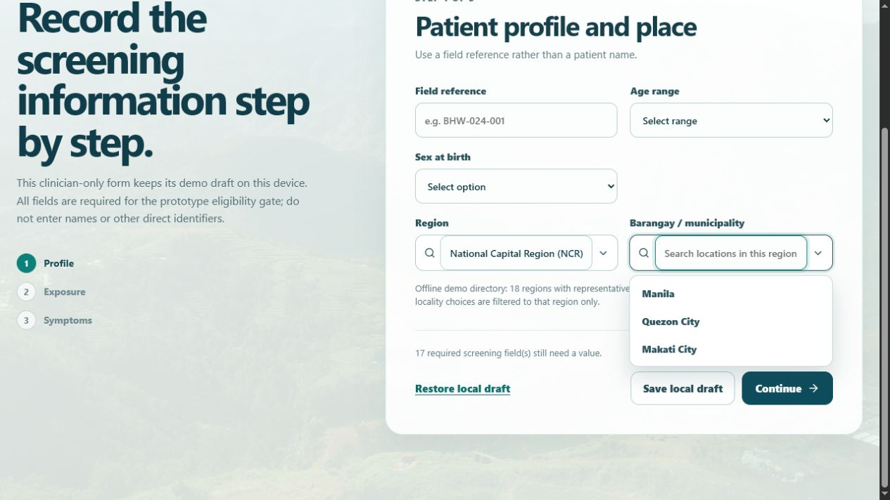

# TASK-008 review pack — Dependent searchable region and locality selectors

## Goal and user-visible feature

Screening step 1 now uses type-to-filter dropdowns instead of free-text location boxes:

- **Region** searches all 18 Philippine regions by any part of the name or abbreviation.
- **Barangay / municipality** remains disabled until a region is chosen, then searches only the locality choices associated with that region.
- Selecting a new region clears the earlier locality to prevent a mismatched location pair.

## Showcase

1. Start a screening and open the Region selector.
2. Type `ncr`, then select **National Capital Region (NCR)**.
3. Open Barangay / municipality: the menu now shows only Manila, Quezon City, and Makati City.
4. Type part of a locality name to narrow the list, then select it.

## Data boundary

- This is a bundled, offline demo directory: 18 regions with representative municipality/city choices.
- It is not a full, current, or authoritative Philippine barangay registry, and it makes no external request.
- The existing field name is retained for demo-flow compatibility; it accepts the demonstrated locality choice only after its parent region has been selected.

## Verification

- `npm.cmd run build` — passed.
- `node.exe node_modules/vitest/vitest.mjs run src/components/ScreeningLocationFields.test.tsx --reporter=verbose` — passed: 1 test.
- Stage browser walkthrough — passed: selecting NCR showed Manila, Quezon City, and Makati City, without a Region I choice such as Vigan City.

## Known limitations

- The compact directory is intentionally not exhaustive at barangay level.
- A full official directory would need an explicitly approved source, update cadence, storage policy, and a larger offline-data strategy.

## Changed files

- `src/philippines-locations.ts` — static 18-region, representative-locality fixture.
- `src/components/SearchableSelect.tsx` and `.css` — reusable searchable dropdown.
- `src/components/ScreeningLocationFields.tsx` — region-dependent screening controls.
- `src/components/ScreeningLocationFields.test.tsx` — direct dependency/filtering coverage.
- `src/App.tsx` — connects selectors to the screening draft.
- `steering/08-location-selector-agent.md` and stage documentation — task scope and review evidence.

## Approval status

**Awaiting owner review.** No promotion to `main` has occurred.

## Proposed promotion commit(s)

`5b4034d feat(task-008): add dependent location selectors`
