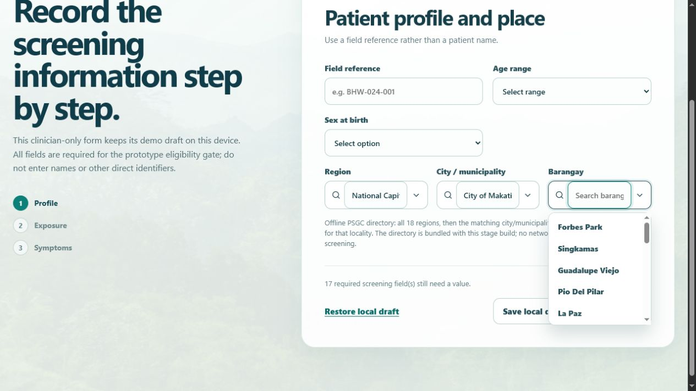

# TASK-008 review pack — Full offline PSGC location selectors

## Goal and user-visible feature

Screening step 1 now uses type-to-filter, parent-dependent dropdowns instead of free-text location boxes:

- **Region** searches all 18 Philippine regions by any part of the name or abbreviation.
- **City / municipality** remains disabled until a region is chosen, then searches all 1,655 bundled choices in that region.
- **Barangay** remains disabled until a city/municipality is chosen, then searches only its bundled barangays.
- Selecting a new region clears city/municipality and barangay; selecting a new city/municipality clears barangay.

## Showcase

1. Start a screening and open the Region selector.
2. Type `ncr`, then select **National Capital Region (NCR)**.
3. Type `makati` in City / municipality and select **City of Makati**.
4. Open Barangay: the menu shows the 23 barangays bundled for City of Makati, including Forbes Park and Poblacion.

## Data boundary

- This is a bundled offline PSGC-based snapshot: 18 regions, 1,655 cities/municipalities, and 42,010 barangay entries.
- It is a 697 KB local JSON asset loaded only when the screening location controls mount. No network request is made while a clinician screens a patient.
- The snapshot is versioned and provenance-recorded. It is not a live government synchronization service, so later official renames or boundary changes require an approved stage update.

## Verification

- `npm.cmd run build` — passed.
- `node.exe node_modules/vitest/vitest.mjs run src/components/ScreeningLocationFields.test.tsx --reporter=verbose` — passed: 2 tests.
- Stage browser walkthrough — passed: selecting NCR, then City of Makati, exposed only City of Makati's 23 barangays.

## Known limitations

- The packaged snapshot requires a deployed app or local server; it is not a complete progressive-web-app offline cache by itself.
- The PSA page currently publishes newer quarterly naming corrections. This snapshot requires an explicitly approved refresh task before those changes are incorporated.

## Changed files

- `src/data/psgc-2026-01-13.json` — bundled normalized hierarchy.
- `src/philippines-locations.ts` — selector types and fast 18-region index.
- `src/components/ScreeningLocationFields.tsx` and `.test.tsx` — three dependent controls plus full-directory/filtering coverage.
- `src/local-screenings.ts` and `src/App.tsx` — persist the city/municipality selection and reset dependent values safely.
- `docs/stage/location-data-provenance.md`, steering, and this review pack — source, scope, and showcase evidence.

## Approval status

**Awaiting owner review.** No promotion to `main` has occurred.

## Proposed promotion commit(s)

`5b4034d feat(task-008): add dependent location selectors` plus the pending TASK-008 revision commit.
