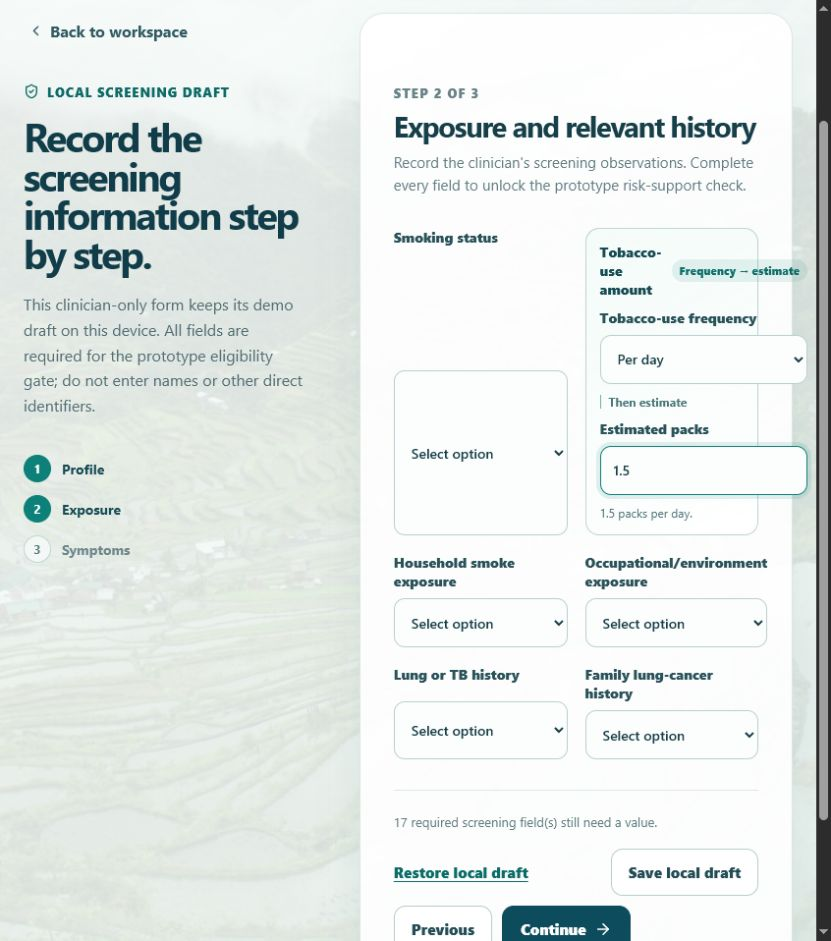

# TASK-008B review pack — Connected tobacco-use amount

## Goal and user-visible feature

Step 2 of the local screening draft now groups the related tobacco-use fields:

- **Tobacco-use frequency** appears first.
- **Estimated packs** sits directly beneath it and is unavailable until a period is selected.
- A live summary confirms the combined entry, such as **1.5 packs per day**.
- **Not a smoker** is an explicit no-use choice; it sets the estimate to zero and locks the pack input.

## Showcase

1. Open local screening step 2.
2. Choose **Per day** in Tobacco-use frequency.
3. Enter `1.5` in Estimated packs.
4. Confirm the connected summary: **1.5 packs per day.**

## Verification

- `npm.cmd run build` — passed.
- `node.exe node_modules/vitest/vitest.mjs run src/components/TobaccoUseAmount.test.tsx --reporter=verbose` — passed: 2 tests.
- Stage browser walkthrough — passed: Estimated packs was disabled initially, enabled after selecting Per day, and rendered `1.5 packs per day.` after entry.

## Changed files

- `src/components/TobaccoUseAmount.tsx` — connected frequency-and-estimate control.
- `src/components/TobaccoUseAmount.test.tsx` — direct interaction and summary coverage.
- `src/App.tsx` and `src/styles.css` — step-2 integration and connected visual treatment.
- `steering/08b-tobacco-use-agent.md` and stage documentation — one-task goal and review evidence.

## Approval status

**Awaiting owner review.** No promotion to `main` has occurred.

## Proposed promotion commit(s)

`Pending stage commit for TASK-008B.`
